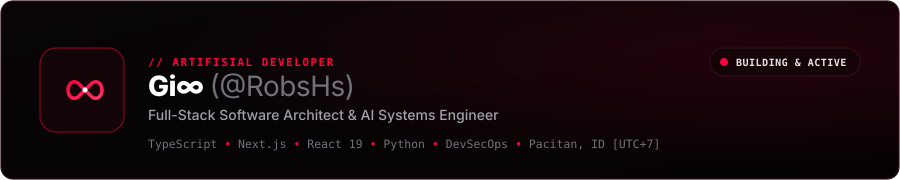
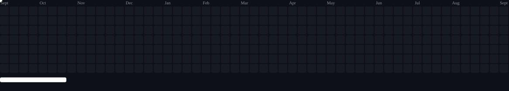

<a id="top"></a>

<p align="center">
  
</p>

<p align="center">
  
</p>

<p align="center">
  
  
  
  <a href="https://github.com/RobsHs">
    
  </a>
</p>

<p align="center">
  <code>[ <a href="#-0x01--operator-dossier--diagnostics">0x01 // RED DOSSIER</a> ]</code> •
  <code>[ <a href="#%EF%B8%8F-0x02--weaponized-arsenal-tech-stack">0x02 // WEAPONIZED ARSENAL</a> ]</code> •
  <code>[ <a href="#-0x03--deployed-payloads--classified-missions">0x03 // CLASSIFIED PAYLOADS</a> ]</code> •
  <code>[ <a href="#-0x04--quantum-telemetry--radar">0x04 // TELEMETRY RADAR</a> ]</code> •
  <code>[ <a href="#-0x05--secure-uplink--comms">0x05 // SECURE UPLINK</a> ]</code>
</p>

---

## ⚡ 0x01 // Operator Dossier & Diagnostics

```console
╔════════════════════════════════════════════════════════════════════════════════════════════════╗
║  OPERATOR CLASSIFIED DOSSIER :: CODE IDENTITY "Gi∞" (@RobsHs) [RED PROTOCOL]                  ║
╚════════════════════════════════════════════════════════════════════════════════════════════════╝
┌──(root㉿RobsHs-RedDeck)-[~]
└─# neofetch --profile --aura=crimson --threat=maximum

          .---.           OPERATOR       : Gi∞ (@RobsHs)
         /     \          CLEARANCE      : LEVEL 5 // UNRESTRICTED ROOT [UID 0]
        | () () |         DESIGNATION    : Offensive Full-Stack Architect & Red Operative
         \  _  /          DIRECTIVE      : "High Risk. High Income. Zero Tolerance for Failure."
          /   \           COMBAT STATUS  : 100% OPERATIONAL • CONTINUOUS HIGH-YIELD EXECUTION
         /     \          NEURAL CORE    : Gemini 2.0 Pro • Claude 3.7 • OpenAI • Deep Agents
        / /| |\ \         PRIMARY WEAPONS: TypeScript • React 19 • Next.js • Python • Linux
       (_/ | | \_)        TARGET SECTOR  : Enterprise Web Systems, Distributed Grids & Scalable Apps
           "-"            FIREWALL       : ARMED [AES-256-GCM // HARDENED AGAINST ALL VECTORS]
```

### 🩸 Red Operative Doctrines

- ⚡ **Aggressive Frontend Velocity**: Engineering blisteringly fast client experiences with React 19, Next.js, and Tailwind CSS v4. Clean, modular, and visually lethal.
- 🛡️ **Hardened Resilient Infrastructure**: Architecting microservices, asynchronous queues, and database engines with Python, Node.js, and SQL/NoSQL frameworks.
- 🧠 **Neural AI Multipliers**: Leveraging Google Gemini, Claude, and deep automated agent pipelines to execute engineering tasks at 10x velocity.
- 💼 **The Gi∞ Ethos**: _"High Risk, High Income. Build without hesitation. Ship without mercy. Dominate the domain."_

---

## 🛠️ 0x02 // Weaponized Arsenal (Tech Stack)

### 🗡️ Primary Exploit Vectors (Core Languages)

<p align="center">
  <a href="https://skillicons.dev">
    
  </a>
</p>

### 🛡️ Frontline Infiltration (Client-Side Vector)

<p align="center">
  <a href="https://skillicons.dev">
    
  </a>
</p>

### ⚙️ Underground Persistence (Backend, Data & Cloud Infrastructure)

<p align="center">
  <a href="https://skillicons.dev">
    
  </a>
</p>

### 🧰 Tactical Hardware & Offensive Deployment Grid

<p align="center">
  <a href="https://skillicons.dev">
    
  </a>
</p>

### 🧠 Autonomous Neural Warfare (AI Frameworks & Agentic Systems)

<p align="center">
  
  
  
  
  
</p>

---

## 🚀 0x03 // Deployed Payloads & Classified Missions

<p align="center">
  <b>MISSION MANIFEST: PUBLICLY DEPLOYED HIGH-IMPACT SYSTEMS</b>
</p>

| Designation                                                                                                    | Vector & Briefing                                                                                                                                                                                     | Tech Matrix                                                |                                                  Gateway Access                                                  |
| :------------------------------------------------------------------------------------------------------------- | :---------------------------------------------------------------------------------------------------------------------------------------------------------------------------------------------------- | :--------------------------------------------------------- | :--------------------------------------------------------------------------------------------------------------: |
| <br><b>QR-PRO</b>                   | <code>[PAYLOAD 0x01]</code> <b>Neural QR Studio & Scanner</b><br>AI-augmented QR generation suite, deep telemetry injector, canvas rasterization, and instant bulk vector export.                     | `TypeScript`<br>`React 19`<br>`Gemini AI`<br>`Tailwind v4` | [⚡ **ACCESS GATEWAY**](https://qr-pro-ten.vercel.app)<br>[📦 **SOURCE REPO**](https://github.com/RobsHs/QR-PRO) |
| <br><b>CMAKER</b>             | <code>[PAYLOAD 0x02]</code> <b>Cryptographic Certificate Studio</b><br>WYSIWYG credential forgery-proof studio, CSV batch synthesizer, instant public verification portal, and 300 DPI vector engine. | `TypeScript`<br>`React 19`<br>`Tailwind v4`<br>`jsPDF`     |  [⚡ **ACCESS GATEWAY**](https://cmakers.vercel.app/)<br>[📦 **SOURCE REPO**](https://github.com/RobsHs/CMAKER)  |
| <br><b>WEB-DEV10</b>                 | <code>[PAYLOAD 0x03]</code> <b>Vintage OS Sandbox (Win98)</b><br>Isolated browser-based emulation of the classic Win98 kernel, window manager, vintage file system, and reactive retro telemetry.     | `TypeScript`<br>`React 19`<br>`Tailwind CSS`<br>`Vite`     |                            [📦 **SOURCE REPO**](https://github.com/RobsHs/WEB-DEV10)                             |
| <br><b>SmartNotes Enterprise</b> | <code>[PAYLOAD 0x04]</code> <b>Encrypted Knowledge Vault</b><br>Hardened enterprise productivity ecosystem with encrypted storage models, relational schemas, and low-latency REST endpoints.         | `Python`<br>`SQLAlchemy`<br>`FastAPI / CLI`                |                      [📦 **SOURCE REPO**](https://github.com/RobsHs/SmartNotes_Enterprise)                       |
| <br><b>MARTFLOW & POS</b>          | <code>[PAYLOAD 0x05]</code> <b>Transaction Terminal Grid</b><br>Mission-critical POS & inventory telemetry engine with role-based cashier privilege escalation controls and automated audit logs.     | `PHP`<br>`MySQL`<br>`JavaScript`                           |                             [📦 **SOURCE REPO**](https://github.com/RobsHs/MARTFLOW)                             |

<p align="center">
  <i>⚡ Scanning for active vectors: Explore all repositories on <a href="https://github.com/RobsHs?tab=repositories">RobsHs Control Grid</a>.</i>
</p>

---

## 📊 0x04 // Quantum Telemetry & Radar

<p align="center">
  
  
</p>

<p align="center">
  
</p>

---

## 🕹️ 0x04.1 // Breakout Infiltration Grid (Pong Brick Breaker)

<p align="center">
  <code>[ ARCADE RADAR // BREAKOUT PROTOCOL // ELIMINATING CONTRIBUTION BRICKS ]</code>
</p>

<p align="center">
  
</p>

---

## 🌐 0x05 // Secure Uplink & Comms

```
[+] TRANSMISSION PROTOCOL : CRIMSON ENCRYPTED TLS 1.3 / SHA-512
[+] LISTENING ON          : 0.0.0.0:* [ALL INTERFACES]
[+] PGP KEY STATUS        : ACTIVE & VERIFIED
```

<p align="center">
  <a href="https://github.com/RobsHs" target="_blank">
    
  </a>
  <a href="https://linkedin.com/in/" target="_blank">
    
  </a>
  <a href="https://instagram.com/" target="_blank">
    
  </a>
  <a href="mailto:?subject=RED_ENCRYPTED_UPLINK%20%3A%3A%20COLLABORATION" target="_blank">
    
  </a>
</p>

---

<p align="center">
  
</p>

<p align="center">
  <a href="#top">
    <code>[ ⬆ REBOOT TO ROOT ]</code>
  </a>
</p>
